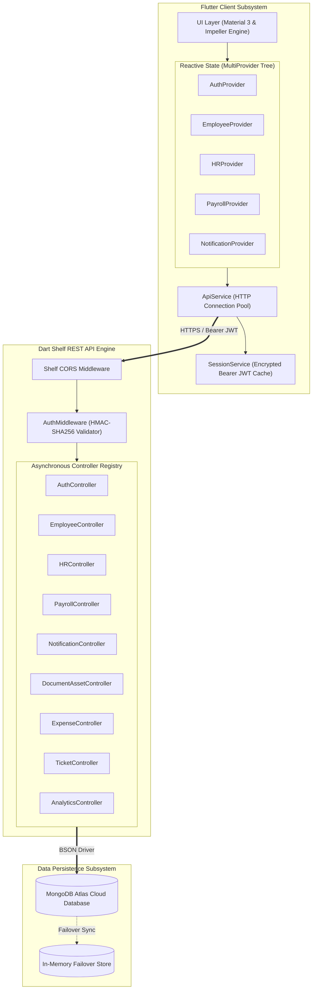
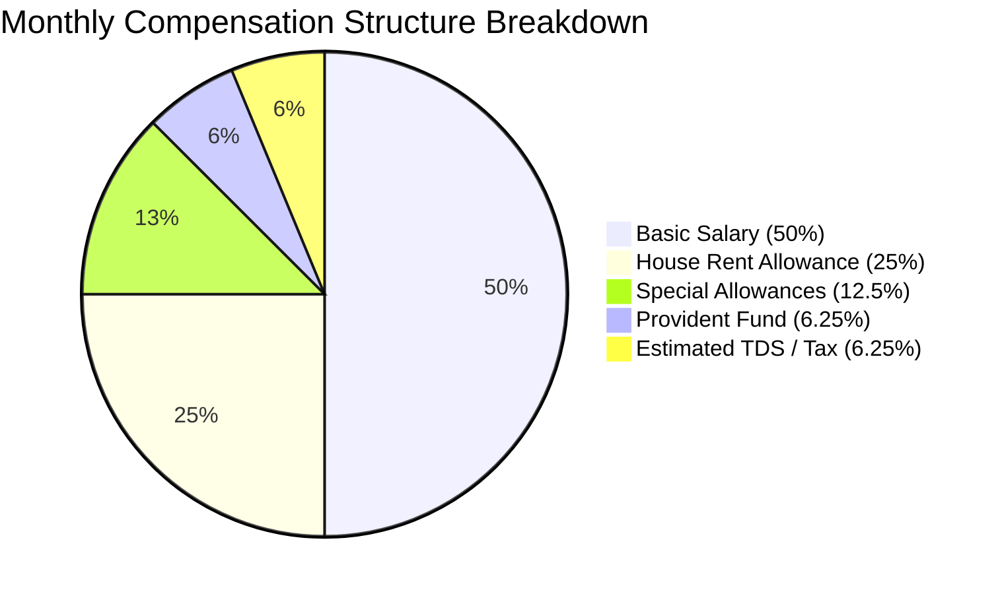
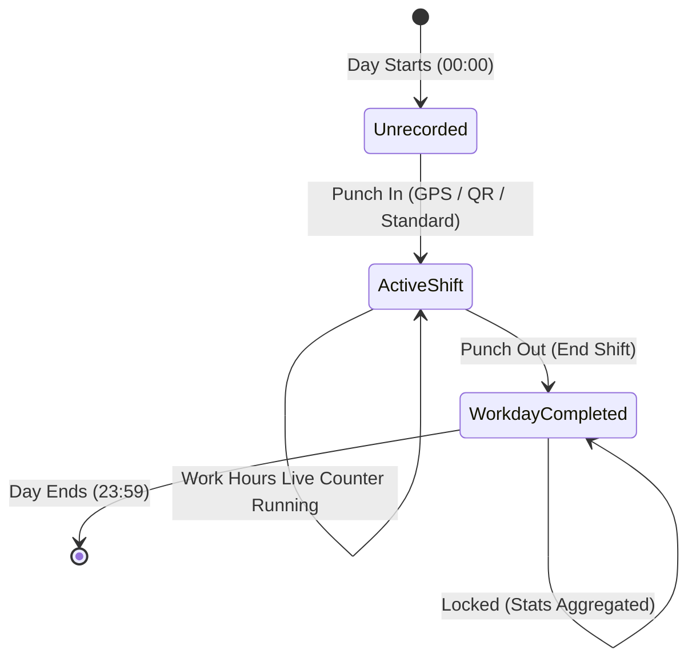
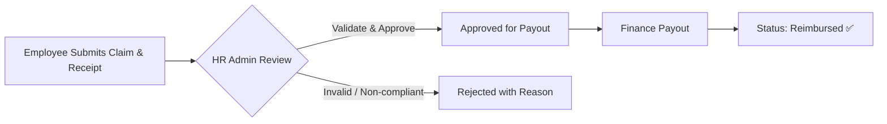
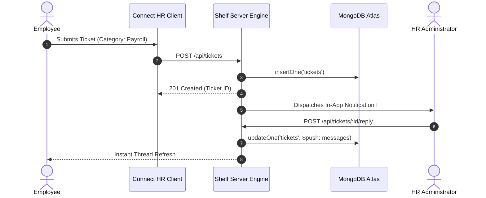
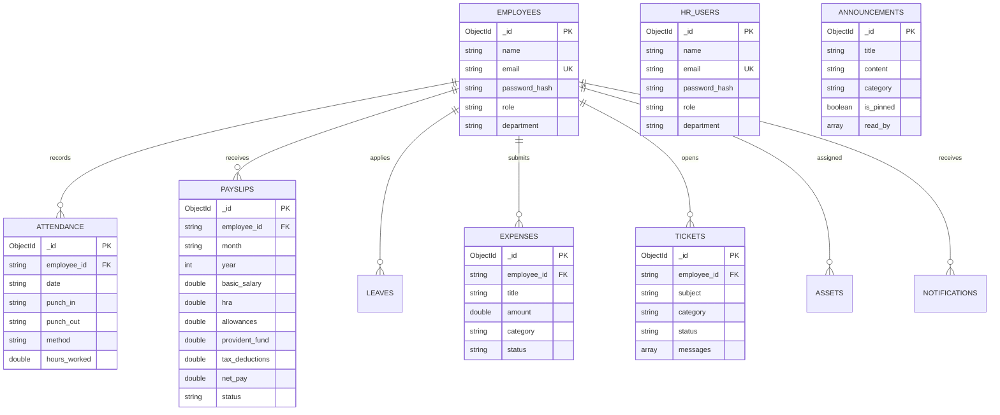

# Connect HR Enterprise Workplace Platform
### *Technical Specification, Architectural Blueprint & Domain Documentation*

[](https://flutter.dev)
[](https://dart.dev)
[](https://pub.dev/packages/shelf)
[](https://www.mongodb.com/atlas)
[](https://jwt.io)

---

## 1. System Overview & Engineering Philosophy

**Connect HR** is a unified, full-stack enterprise platform built for end-to-end human capital governance, workforce operations, compensation modeling, and employee engagement. 

Rather than adopting a fragmented polyglot stack, the platform uses a **Unified Dart Ecosystem** (Flutter client + Dart Shelf micro-server). This guarantees:
* **Zero-Deserialization Impedance Mismatch:** Frontend and backend share identical domain entities, scalar types, serialization keys, and business validation rules.
* **Deterministic Concurrency:** Dart's single-threaded event loop and asynchronous isolates eliminate thread-locking, race conditions, and heavy thread-pool overheads.
* **Sub-Millisecond Response Latencies:** Low-overhead HTTP routing and direct BSON stream serialization to MongoDB Atlas.

---

## 2. High-Level Architectural Blueprint



---

## 3. Security, Identity & Cryptographic Protocols

### 3.1 Authentication Handshake & JWT Lifecycle
Authentication follows stateless Bearer Token authorization powered by `dart_jsonwebtoken`:
1. Client submits credentials over TLS to `/api/auth/login`.
2. Backend queries partitioned collections (`hr_users`, `employees`) with case-insensitive normalization.
3. Passwords are verified against stored hashes.
4. On success, an **HMAC-SHA256 signed JWT** is minted with standard claims:
   ```json
   {
     "user_id": "6ac09f9b9c9536ae5438cfb6",
     "role": "HR",
     "exp": 1790953827,
     "iat": 1790867427
   }
   ```
5. Client intercepts the token via [SessionService](file:///d:/Connect-HRapp/lib/core/services/session_service.dart) and injects `Authorization: Bearer <token>` into all downstream HTTP requests.

### 3.2 Cryptographic Password Hashing Algorithm
User passwords undergo dynamic salting and SHA-256 derivation via [PasswordHasher](file:///d:/Connect-HRapp/server/lib/utils/password_hasher.dart):
$$\text{Salt} = \text{Base64}(\text{RandomBytes}(16))$$
$$\text{Digest} = \text{SHA-256}(\text{Salt} \parallel \text{Password})$$
$$\text{Stored Record} = \text{"sha256\$" } \parallel \text{Salt} \parallel \text{"\$" } \parallel \text{Hex}(\text{Digest})$$

### 3.3 Strict Role-Based Partitioning (RBAC)
* **Administrative Isolation:** HR Administrators are maintained exclusively in `hr_users`.
* **Zero Cross-Contamination:** HR records are excluded from standard employee directory lookups, organizational charts, and team rosters.
* **Middleware Guards:** `AuthMiddleware` verifies both signature integrity and `isHR` authorization flags before executing administrative endpoints (e.g. `/api/hr/*`, `/api/payroll/generate`, `/api/reports/export-*`).

---

## 4. Deep Technical Breakdown: 8 Enterprise Modules

### 4.1 💰 Compensation & Payroll Processing Engine
* **Mathematical Calculation Pipeline:**
  $$\text{Monthly Gross} = \text{Basic} + \text{HRA} + \text{Special Allowances}$$
  $$\text{Total Deductions} = \text{Provident Fund (PF)} + \text{Estimated TDS}$$
  $$\text{Net Pay (Take-Home)} = \text{Monthly Gross} - \text{Total Deductions}$$
  $$\text{Annual Cost-to-Company (CTC)} = \text{Monthly Gross} \times 12$$



* **Client-Side PDF Document Generation:** Implemented in [PdfGenerator](file:///d:/Connect-HRapp/lib/core/utils/pdf_generator.dart) using low-level `pdf` vector primitives. Renders high-DPI A4 statement layouts with embedded corporate watermarks, tabular breakdown structures, and auto-generated payment receipts ready for direct thermal printing or file sharing.

---

### 4.2 📍 Smart Attendance, GPS Geofencing & Reception Kiosk
* **Haversine Geodetic Perimeter Calculation:**
  To prevent location spoofing or remote punch attempts, the backend calculates the exact geodesic distance between the employee's coordinate $(\phi_1, \lambda_1)$ and the office coordinate $(\phi_2, \lambda_2)$:
  $$a = \sin^2\left(\frac{\Delta\phi}{2}\right) + \cos(\phi_1)\cos(\phi_2)\sin^2\left(\frac{\Delta\lambda}{2}\right)$$
  $$c = 2 \cdot \text{atan2}\left(\sqrt{a}, \sqrt{1-a}\right)$$
  $$d = R \cdot c \quad (\text{where } R = 6,371,000 \text{ meters})$$
  *Perimeter Constraint:* Access is granted only when $d \le 500\text{m}$.
* **Dynamic Time-Bounded QR Kiosk:** The office reception display polls `/api/employee/qr-code` to render time-sensitive tokens (`CONNECT_HR_OFFICE_CHECKIN_<DATE>_SECURE`). Scanning validates date matching and office proximity.



---

### 4.3 📢 Company Notice Board & Broadcast Engine
* **Priority Tagging & Sticky Pinning:** Notices support categorical tagging (`Policy`, `Event`, `Alert`, `Holiday`) and boolean sticky pinning (`is_pinned: true`).
* **Atomic Read-Receipt Array:** The backend tracks read states using MongoDB array updates (`$addToSet: { read_by: userId }`), enabling instant unread badge calculation across client devices.

---

### 4.4 📊 Expense Claims & Reimbursements Workflow
* **Attachment Pipeline:** Mobile camera and gallery capture converted to encrypted base64 payload attachments or binary multipart data.



---

### 4.5 💬 HR Helpdesk & Live Ticketing Subsystem
* **Bi-Directional Message Threading:** Employees open tickets under specific categories (`Payroll`, `Hardware`, `Policies`, `General`). Each ticket encapsulates a chronological message thread with sender metadata and timestamps.



---

### 4.6 📄 Document Vault & IT Hardware Inventory
* **Employee Document Vault:** Partitioned vault storing national identification numbers, credential verification metadata, and contracts with audit status flags (`Verified`, `Pending`).
* **IT Asset Lifecycle Management:** Serial number tracking, hardware classifications (`Laptop`, `Monitor`, `Mobile`), assignment dates, and return condition statuses.

---

### 4.7 📈 HR Analytics Engine & Automated CSV Serialization
* **Statistical Metrics Aggregation:** Aggregates real-time department distributions, leave ratios, and rolling retention metrics.
* **Streaming CSV Serialization:** Administrative export endpoints (`/api/reports/export-attendance`, `/api/reports/export-leaves`) generate RFC 4180-compliant CSV datasets on-the-fly with custom HTTP streaming headers:
  ```http
  Content-Type: text/csv; charset=utf-8
  Content-Disposition: attachment; filename="attendance_report_2026-10-03.csv"
  ```

---

### 4.8 🔔 In-App Notification Center
* **Event-Driven Dispatch:** System triggers automatic notifications upon payslip generation, leave status transitions, emergency notices, and ticket responses.
* **Badge Counters:** Real-time unread aggregation displayed via notification bell badges in the application top bar.

---

## 5. REST API Contract Specification

| Method | Endpoint | Access Level | Description |
| :--- | :--- | :--- | :--- |
| `POST` | `/api/auth/login` | Public | Authenticates credentials and issues signed JWT |
| `POST` | `/api/auth/signup` | Public | Registers a new employee account |
| `GET` | `/api/employee/profile` | Employee | Retrieves authenticated user profile |
| `POST` | `/api/attendance` | Employee | Registers smart punch (standard / geofence / QR) |
| `GET` | `/api/attendance` | Employee | Retrieves 30-day historical attendance records |
| `GET` | `/api/employee/work-hours-stats` | Employee | Aggregates total hours, averages, and overtime |
| `GET` | `/api/employee/qr-code` | Employee/Kiosk | Generates current reception dynamic QR token |
| `POST` | `/api/leave` | Employee | Submits a time-off application |
| `GET` | `/api/leave` | Employee | Fetches personal leave application history |
| `GET` | `/api/payroll/my-payslips` | Employee | Retrieves all issued personal payslips |
| `GET` | `/api/payroll/structure` | Employee / HR | Returns itemized CTC salary structure |
| `GET` | `/api/payroll/all` | HR Admin | Retrieves company-wide payslips |
| `POST` | `/api/payroll/generate` | HR Admin | Generates and issues a digital salary slip |
| `GET` | `/api/announcements` | Authenticated | Retrieves company notice feed |
| `POST` | `/api/announcements` | HR Admin | Broadcasts a new company notice |
| `POST` | `/api/announcements/<id>/read` | Authenticated | Marks an announcement as read |
| `GET` | `/api/expenses/my` | Employee | Fetches personal expense claims |
| `POST` | `/api/expenses` | Employee | Files an expense claim with receipt |
| `GET` | `/api/expenses/all` | HR Admin | Retrieves all pending & processed expenses |
| `POST` | `/api/expenses/<id>/status` | HR Admin | Updates expense status (Approved/Rejected) |
| `GET` | `/api/tickets/my` | Employee | Lists personal helpdesk support tickets |
| `POST` | `/api/tickets` | Employee | Opens a new support ticket |
| `POST` | `/api/tickets/<id>/reply` | Authenticated | Appends message to support thread |
| `GET` | `/api/vault/documents` | Authenticated | Retrieves employee vault documents |
| `GET` | `/api/vault/assets/my` | Employee | Lists IT hardware assigned to user |
| `GET` | `/api/hr/analytics` | HR Admin | Returns live headcount and leave counters |
| `GET` | `/api/reports/advanced-analytics`| HR Admin | Full statistical breakdown and department distributions |
| `GET` | `/api/reports/export-attendance` | HR Admin | Streams attendance CSV file |
| `GET` | `/api/reports/export-leaves` | HR Admin | Streams leave requests CSV file |
| `GET` | `/api/notifications` | Authenticated | Retrieves user notification stream |

---

## 6. Database Schema & Data Models



---

## 7. Complete Repository Layout

```
Connect-HRapp/
├── lib/                             # Flutter Cross-Platform Frontend Subsystem
│   ├── main.dart                    # Application root, provider initialization & route bindings
│   ├── core/                        # Core infrastructural utilities & services
│   │   ├── constants/
│   │   │   ├── api_constants.dart   # REST endpoint URL definitions
│   │   │   └── app_colors.dart      # Design system color tokens & palette mappings
│   │   ├── network/
│   │   │   ├── api_exception.dart   # Strongly-typed HTTP error model
│   │   │   └── api_service.dart     # HTTP client, token interceptors & network handlers
│   │   ├── routes/
│   │   │   └── app_routes.dart      # Named navigation routes registry
│   │   ├── services/
│   │   │   └── session_service.dart # Local JWT token cache & persistence (SharedPreferences)
│   │   ├── theme/
│   │   │   └── app_theme.dart       # Material 3 light & dark theme specifications
│   │   └── utils/
│   │       └── pdf_generator.dart   # Client-side PDF payslip rendering engine
│   ├── models/                      # Strongly-typed domain data models
│   │   ├── advanced_analytics_model.dart
│   │   ├── analytics_model.dart
│   │   ├── announcement_model.dart
│   │   ├── attendance_model.dart
│   │   ├── auth_models.dart
│   │   ├── document_asset_model.dart
│   │   ├── employee_model.dart
│   │   ├── expense_model.dart
│   │   ├── leave_model.dart
│   │   ├── notification_model.dart
│   │   ├── payroll_model.dart
│   │   ├── profile_model.dart
│   │   └── ticket_model.dart
│   ├── providers/                   # Reactive State Management Controllers
│   │   ├── advanced_analytics_provider.dart
│   │   ├── announcement_provider.dart
│   │   ├── auth_provider.dart
│   │   ├── document_asset_provider.dart
│   │   ├── employee_provider.dart
│   │   ├── expense_provider.dart
│   │   ├── hr_provider.dart
│   │   ├── notification_provider.dart
│   │   ├── payroll_provider.dart
│   │   ├── theme_provider.dart
│   │   └── ticket_provider.dart
│   ├── screens/                     # Feature Views & User Experience Screens
│   │   ├── analytics/analytics_screen.dart
│   │   ├── announcements/announcements_screen.dart
│   │   ├── attendance/smart_attendance_screen.dart
│   │   ├── auth/
│   │   │   ├── employee_login_screen.dart
│   │   │   ├── hr_login_screen.dart
│   │   │   └── signup_screen.dart
│   │   ├── employee/employee_dashboard_screen.dart
│   │   ├── expenses/expenses_screen.dart
│   │   ├── helpdesk/
│   │   │   ├── helpdesk_screen.dart
│   │   │   └── ticket_chat_screen.dart
│   │   ├── hr/
│   │   │   ├── hr_attendance_screen.dart
│   │   │   ├── hr_dashboard_screen.dart
│   │   │   ├── hr_employees_screen.dart
│   │   │   └── hr_leaves_screen.dart
│   │   ├── landing/landing_screen.dart
│   │   ├── notifications/notifications_screen.dart
│   │   ├── payroll/payroll_screen.dart
│   │   └── vault/document_vault_screen.dart
│   └── widgets/                     # Modular, Reusable Material 3 UI Components
│       ├── action_card.dart
│       ├── analytics_card.dart
│       ├── custom_button.dart
│       ├── custom_text_field.dart
│       ├── status_badge.dart
│       └── dialogs/
│           ├── apply_leave_dialog.dart
│           ├── hire_employee_dialog.dart
│           └── server_config_dialog.dart
├── server/                          # Full-Stack Dart Asynchronous Server Subsystem
│   ├── bin/
│   │   ├── server.dart              # Shelf router, CORS middleware pipeline & server boot
│   │   └── test_api.dart            # Automated integration test suite across all 8 modules
│   ├── lib/
│   │   ├── config/server_config.dart
│   │   ├── controllers/             # Endpoint Controllers (Auth, Payroll, Attendance, etc.)
│   │   ├── db/database_service.dart # Dual Database Engine (MongoDB Atlas + Memory Fallback)
│   │   ├── middleware/auth_middleware.dart # JWT Verification & RBAC Guards
│   │   └── utils/password_hasher.dart      # PBKDF2/SHA-256 Hasher
│   └── pubspec.yaml                 # Server dependencies (shelf, mongo_dart, dart_jsonwebtoken)
├── pubspec.yaml                     # Client dependencies (flutter, provider, fl_chart, pdf)
└── analysis_options.yaml            # Static code analysis configuration
```
